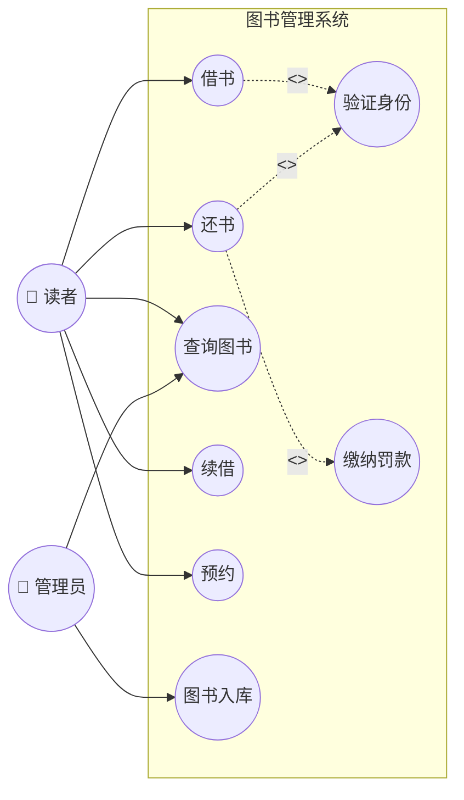
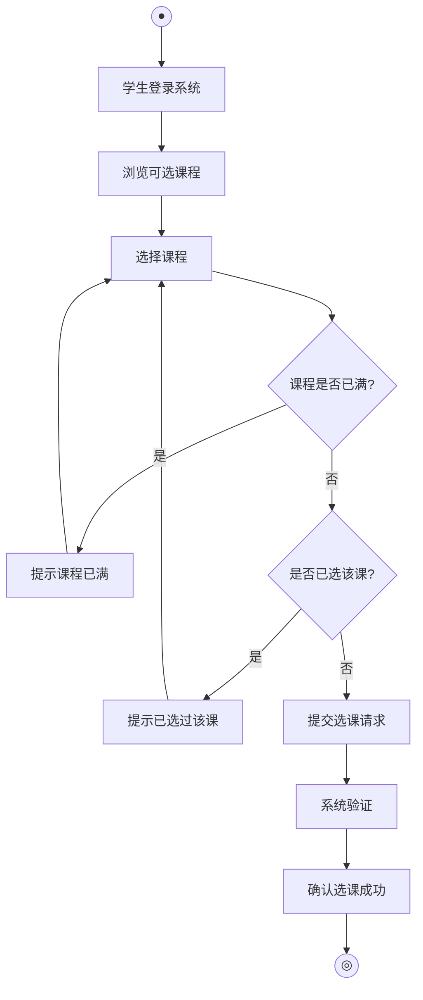
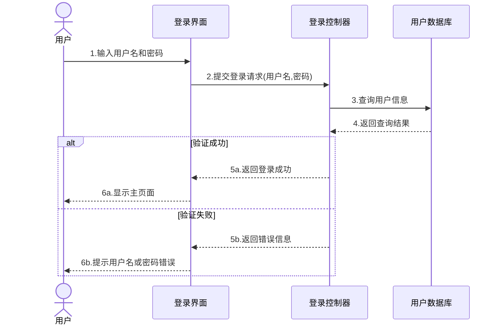
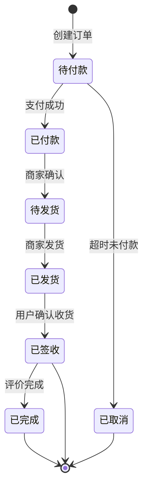
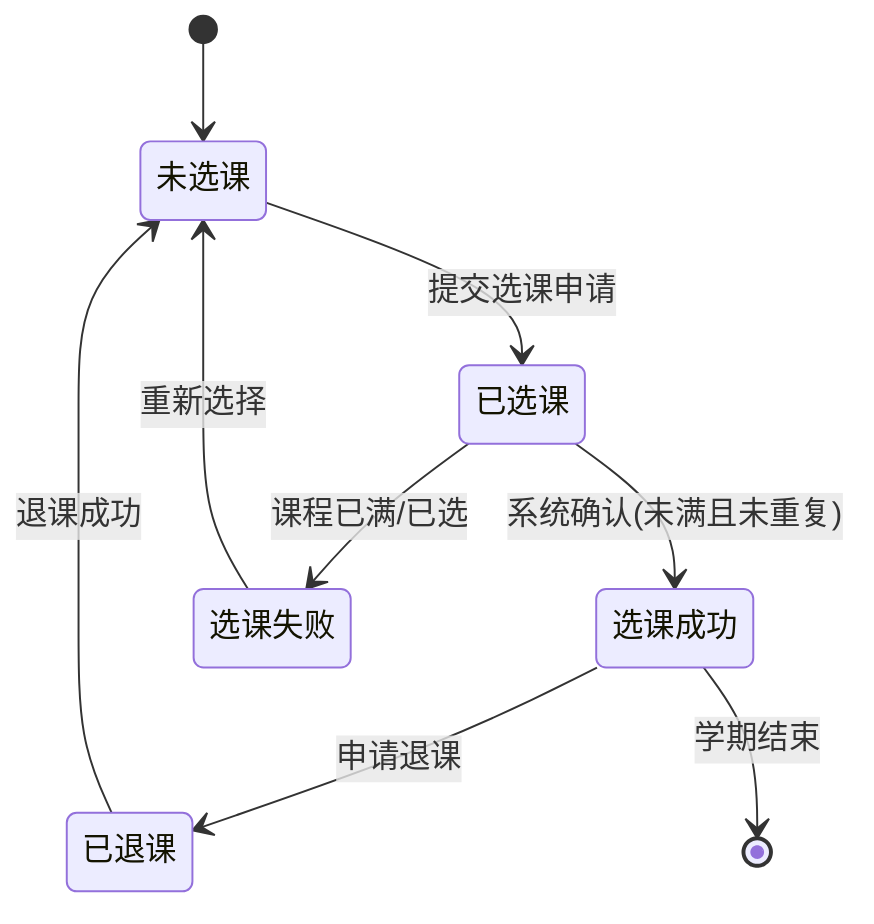
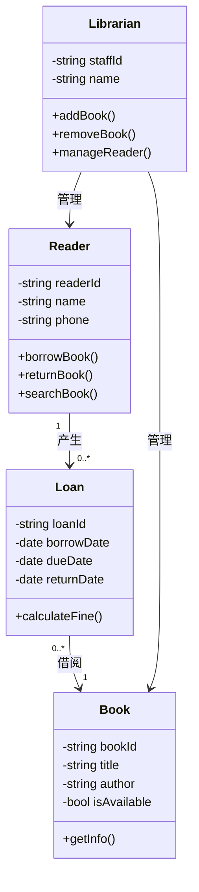

# 软件工程导论 · UML图与ER图画法样例

> 本文档使用 Mermaid 语法，在 Obsidian 中可直接渲染。复制到 Obsidian 打开即可看到图表效果。

---

## 1. 用例图（Use Case Diagram）

### 样例：图书管理系统



### 用例关系说明

| 关系 | 符号 | 含义 | 示例 |
|------|------|------|------|
| 包含 include | `-.->\|<<include>>\|` | 执行A**必须**执行B | 借书 → 验证身份 |
| 扩展 extend | `-.->\|<<extend>>\|` | 特定条件下B**扩展**A | 还书 → 缴纳罚款 |
| 关联 | `-->` | 参与者与用例的连接 | 读者 → 借书 |

### 答题步骤
1. 找**参与者**（谁用系统？）→ 画人形
2. 找**用例**（系统提供什么服务？）→ 画椭圆
3. 画**关联线**（谁做什么？）→ 实线
4. 标**关系**（用例之间）→ 虚线 + stereotype

---

## 2. 活动图（Activity Diagram）

### 样例：学生选课流程（含泳道）



### 活动图符号速查

| 符号 | 含义 | 画法 |
|------|------|------|
| ● | 初始节点（开始） | 实心圆 |
| ◎ | 活动最终节点（结束） | 牛眼/同心圆 |
| [活动] | 动作/活动 | 圆角矩形 |
| {条件?} | 判断节点 | 菱形 |
| 粗横线 | 分叉/汇合 | 并行处理 |

### 答题步骤
1. 找**起点和终点**
2. 列出所有**活动步骤**
3. 识别**判断条件**（是/否分支）
4. 识别**并行处理**（如有则加分叉/汇合）
5. 必要时加**泳道**（区分不同参与者）

---

## 3. ER图（实体-关系图）

### 样例：学生选课系统

```mermaid
erDiagram
    DEPARTMENT ||--o{ MAJOR : "1对多"
    MAJOR ||--o{ CLASS : "1对多"
    CLASS ||--o{ STUDENT : "1对多"
    MAJOR ||--o{ COURSE : "1对多"
    STUDENT }o--o{ COURSE : "多对多(选课)"

    DEPARTMENT {
        string 院系代码 PK
        string 院系名称
    }
    MAJOR {
        string 专业代码 PK
        string 专业名称
        string 所属院系 FK
    }
    CLASS {
        string 班级代码 PK
        string 班级名称
        string 所属专业 FK
    }
    STUDENT {
        string 学号 PK
        string 姓名
        string 性别
        date 出生年月
        string 所属班级 FK
    }
    COURSE {
        string 课程代码 PK
        string 课程名称
        int 学分
        string 所属专业 FK
    }
```

### Chen表示法画法（考试画法）

```
考试中手绘ER图时用Chen表示法：

  矩形 = 实体        椭圆 = 属性        菱形 = 关系

  ┌──────────┐        ╭─────╮          ◇────────◇
  │  学生    │───学号─→│ 学号 │         ╱  选课关系 ╲
  │          │───姓名─→│ 姓名 │        ◇────────────◇
  └──────────┘        ╰─────╯

  连线上标注基数：1:1  /  1:N  /  M:N
```

### 关系基数标注

| 基数 | 含义 | 示例 |
|------|------|------|
| 1:1 | 一对一 | 一个人 ↔ 一个身份证 |
| 1:N | 一对多 | 一个班级 → 多个学生 |
| M:N | 多对多 | 学生 ↔ 课程（通过成绩关联） |

### 答题步骤
1. **识别实体**（名词）→ 矩形
2. **识别属性**（实体的特征）→ 椭圆
3. **识别关系**（动词）→ 菱形
4. **标注基数**（1:1 / 1:N / M:N）
5. 标出**主键PK**和**外键FK**

---

## 4. 顺序图（Sequence Diagram）

### 样例：用户登录过程



### 顺序图要素

| 要素 | 画法 | 说明 |
|------|------|------|
| 对象/参与者 | 顶部矩形 + 下方虚线 | 横向排列 |
| 生命线 | 虚线 | 从对象向下延伸 |
| 激活条 | 窄矩形覆盖生命线 | 表示对象正在执行 |
| 同步消息 | 实线箭头 → | 调用并等待返回 |
| 返回消息 | 虚线箭头 --> | 返回结果 |
| 自我调用 | 折回箭头 | 对象调用自身方法 |

### 答题步骤
1. 列出**所有对象**（参与者 + 系统对象）→ 横向排列
2. 按**时间顺序**从上到下画消息
3. 标注**消息编号**（1, 2, 3...）
4. 返回消息用**虚线**
5. 可选：用 alt 框表示条件分支

---

## 5. 状态图（State Diagram）

### 样例：订单状态变化



### 样例：学生选课状态变化



### 状态图要素

| 要素 | 画法 | 说明 |
|------|------|------|
| 初始状态 | 实心圆 ● | 只有一个 |
| 终止状态 | 牛眼 ◎ | 可以有多个 |
| 状态 | 圆角矩形 | 对象的某个状态 |
| 转换 | 带箭头线 | 标注 触发事件[条件]/动作 |

### 答题步骤
1. 列出对象所有**状态**（通常是形容词/状态词）
2. 找出状态间的**转换事件**
3. 画 **● → 状态1 → 状态2 → ... → ◎**
4. 在箭头上标注 **事件[条件]**
5. 检查是否有**分支**（一个状态到多个状态）

---

## 6. 类图（Class Diagram）

### 样例：图书管理系统



### 类图关系符号

| 关系 | 符号 | 含义 | 示例 |
|------|------|------|------|
| 关联 | `-->` | 普通关系 | 学生 --> 课程 |
| 聚合 | `o--` | 整体-部分（弱） | 汽车 o-- 轮胎 |
| 组合 | `*--` | 整体-部分（强） | 订单 *-- 订单项 |
| 继承 | `<\|--` | is-a关系 | 大学生 <\|-- 学生 |
| 依赖 | `..>` | 使用关系 | 控制器 ..> 服务 |
| 实现 | `..|>` | 接口实现 | 狗 ..|> 动物 |

---

## 7. 数据流图（DFD）

### 样例：学生选课系统（顶层图）

```
    ┌─────────┐                    ┌─────────┐
    │  学生   │───── 选课请求 ────→│         │
    │         │←──── 选课结果 ────│  选课   │
    └─────────┘                    │  系统   │
    ┌─────────┐                    │         │
    │  教师   │───── 成绩录入 ────→│         │
    │         │←──── 录入确认 ────│         │
    └─────────┘                    └─────────┘
```

### DFD四要素

| 符号 | 含义 | 画法 |
|------|------|------|
| → 箭头 | 数据流 | 带箭头的线，标注数据名 |
| ○ 圆形 | 加工（处理） | 圆或圆角矩形 |
| = 双横线 | 数据存储 | 开口矩形/双横线 |
| □ 矩形 | 外部实体 | 方框 |

### 画法规则
- 外部实体**不能直接**与数据存储相连
- 加工必须既有**输入**又有**输出**
- 数据流**必须经过加工**
- 数据流经文件时，数据流**不必命名**（有文件名即可）

---

## 速查：考试画图分值分配

| 图 | 分值 | 核心考点 |
|----|------|---------|
| **用例图** | ~10分 | 参与者+用例+include/extend |
| **活动图** | ~10分 | 活动+判断+分叉/汇合+泳道 |
| **ER图** | ~15分 | 实体+属性+关系+基数 |
| 顺序图 | ~8分 | 对象+生命线+消息顺序 |
| 状态图 | ~8分 | 状态+转换事件+初始/终止 |

---

> 💡 **考试提示**：手绘时用铅笔+尺子，先画框架再填内容。用例图和ER图是必考，务必熟练！
